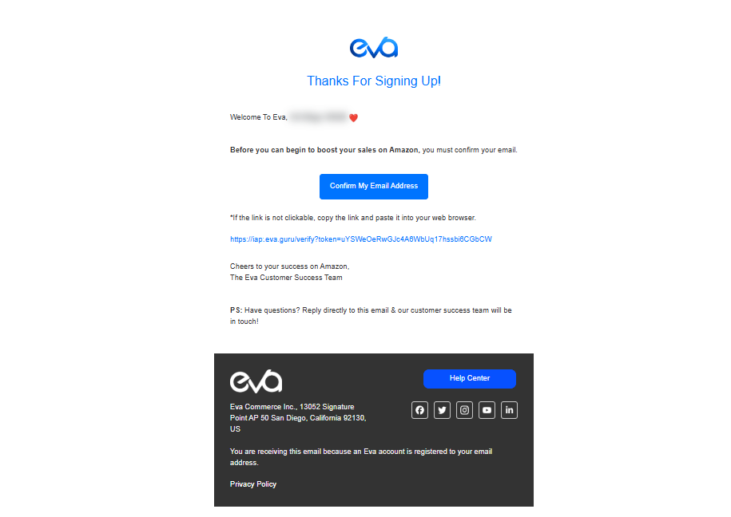

# How to Create an Eva Account

Welcome to Eva! Follow the steps below to create your account and begin your journey with us.

## Step 1: Create An Eva Account
- Click the <a href="https://iapp.eva.guru/welcome" target="_blank" rel="noopener noreferrer">"Create An Eva Account"</a> link to initiate the process. This will open in a new window.

- On the registration page, fill in the required information and click "Create Eva Account" to get started. 

   **Note:** If you have a promo code or special offer, please enter it during registration.

     <!-- Screenshot for welcome page -->

## Step 2: Verify Your Email
- After creating your Eva account, you will be redirected to a confirmation page. Please check the email address you used to register and verify your account.

- You will receive a verification email with the subject “Confirm Your Email Address.” Click on the "Confirm My Email Address" button in the email to complete the verification.
     <!-- Screenshot for verification email -->

## Step 3: Log In To Your Eva Account
- Once your email is confirmed, you will be redirected to a login page.

- Alternatively, visit the [Eva Login Page](https://iapp.eva.guru/login) and log in with your verified credentials.
     <!-- Screenshot for login page -->

- Don't forget to book an onboarding call with our Customer Success Team by using the “Chat with us” button. Our team will guide you through the platform and discuss how Eva can benefit your business.
     <!-- Screenshot for Chat with Us button -->

## Accessing Your Eva Account
- To access your Eva account directly from the website, go to [Eva's Website](https://eva.guru/).
- Click the “Login” button on the upper-right corner of the page, then enter your verified credentials.

   <!--  <!-- Screenshot for Eva Website login -->

**Congratulations!** Your account has been successfully created, and you are now ready to connect your stores to the Eva platform. With your account set up, you're all set to optimize your campaigns.

## Next Steps

1. [Connect Your Store(s) to Eva](getting-started/connecting-your-amazon-store.md)
2. [Connect Your Advertising Account](getting-started/connecting-your-ad-account.md)
