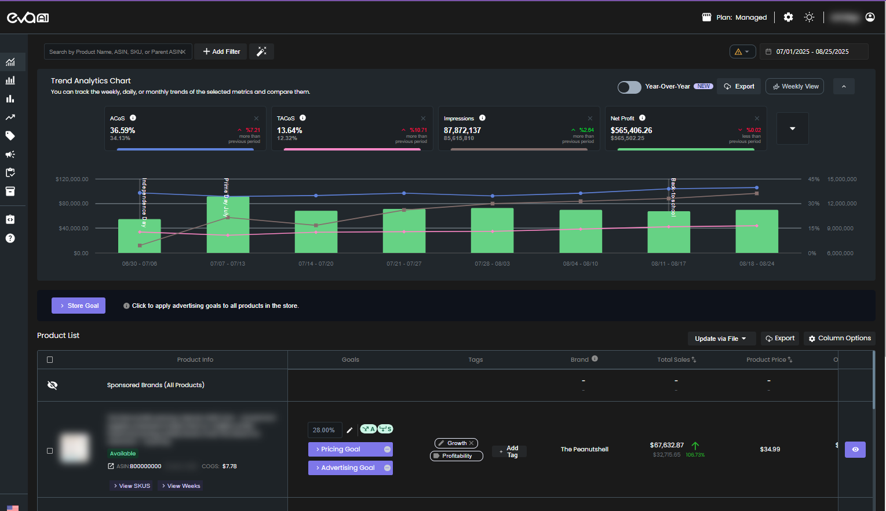
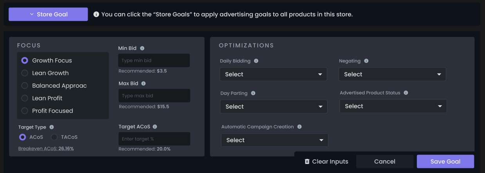
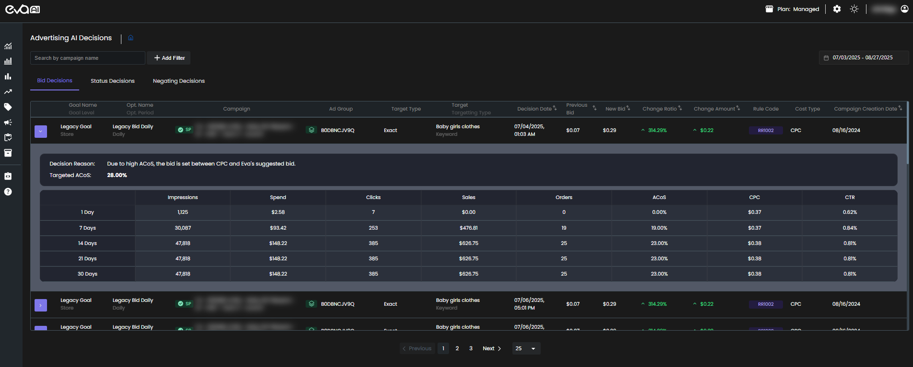

# Welcome to Eva!

Hello, and welcome to Eva! We're thrilled to have you on board. This guide will walk you through the core features of the Eva platform, helping you master your advertising strategy and boost your business on Amazon. We’ve designed this to be a simple, step-by-step journey, starting with the basics and moving toward advanced ad management.

---

### Your Journey with Eva: A Quick Start Guide

The first steps you take are crucial. We’ve laid out a path to help you get up and running quickly so you can start seeing results.

#### 1. Connect Your Accounts
Before you can analyze your performance and set goals, you need to connect your Amazon store and advertising account to Eva. This is the foundation that unlocks all our powerful tools and insights.

- Connect your Amazon store to import your product and sales data.
- Connect your Amazon Advertising account to enable ad-related metrics and insights.

Once these connections are complete, your dashboard will come to life with your live data.

Read more: [Connecting Your Amazon Store](getting-started/connecting-your-amazon-store.md) and [Connecting Your Ad Account](getting-started/connecting-your-ad-account.md).

#### 2. Analyze Performance & Get a Free Audit
With your accounts connected, the **Trend Analytics** page becomes your central hub for understanding your performance. Here, you can review your key metrics, identify trends, and see which products are performing best.
    
Eva also offers a free PPC Audit Report to quickly assess the health of your advertising strategy. This report gives you an overall score and highlights key opportunities for improvement, such as wasted ad spend or critical performance errors, so you know exactly where to focus your efforts.

Read more: [Trend Analytics](performance-analysis-setting-goals/trend-analytics.md) and [Audit Report](reports/audit-report.md).

#### 3. Set Your Advertising Goals
This is where you take control. You can define your advertising strategy by setting goals at different levels. This ensures that Eva's AI works toward the specific outcomes you want for your business.

- **Store-Level Goals**: Set a broad strategy for your entire store.
- **Product-Level Goals**: Override your store-level goals for specific products that need special attention or have different profitability targets.
- **Campaign-Level Goals**: Customize goals directly on your campaigns for maximum control.

You can either choose from a list of pre-defined optimization strategies or create a custom one yourself. If you don’t have any campaigns yet, Eva's AI can automatically create them for you based on your goals.

Read more: [Setting Store-Level Goals](ad-strategies/store-level-goals.md), [Setting Product-Level Goals](ad-strategies/product-level-goals.md), and [Campaign-Level Goals](ad-strategies/campaign-level-goals.md).

#### 4. Optimize & Refine
As your campaigns run, Eva continuously works to improve their performance. The **AI Decisions** page shows you the specific actions our system is taking, such as bid adjustments or negative targeting, and helps you understand the "why" behind each one.

From the **Campaign View** and **Target View** pages, you can get a granular look at your ad campaigns and individual targets (like keywords and ASINs). This gives you the power to fine-tune your strategy at the lowest level and make direct adjustments to bids and status.

Read more: [AI Decisions](reports/ai-decisions.md), [Campaign View](in-depth-views/campaign-view.md), and [Target View](in-depth-views/target-view.md).

This overview provides a solid foundation for your journey. We encourage you to explore the other sections of our Help Center to discover all the ways Eva can help you grow.